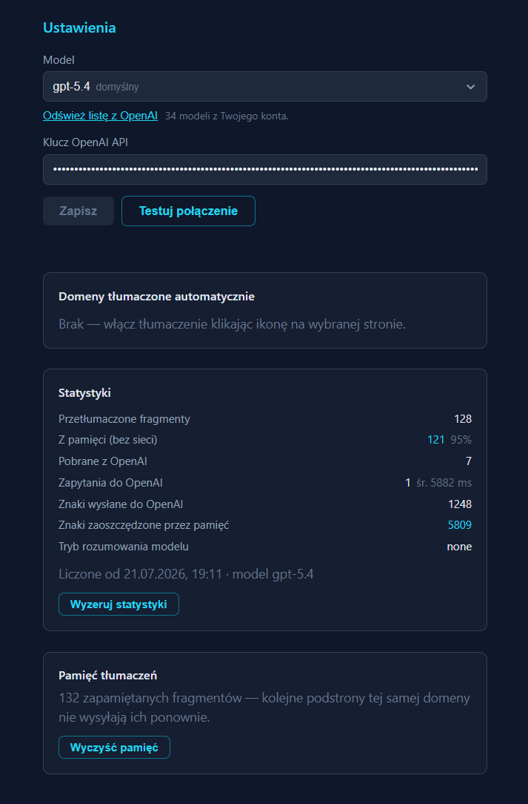

# Tłumacz — cała strona po polsku, jednym kliknięciem

Wchodzisz na zagraniczną stronę, klikasz ikonę — i strona jest po polsku. Wygląda tak samo
jak wcześniej, tylko tekst jest przetłumaczony. Żadnych okienek obok, żadnego kopiowania
i wklejania do tłumacza.

Jedno kliknięcie wystarcza na **cały serwis**. Jeśli włączysz tłumaczenie na stronie
głównej, każda kolejna podstrona tego serwisu też przetłumaczy się sama.

Działa w przeglądarkach **Microsoft Edge** i **Google Chrome**.

---

## Zanim zaczniesz — potrzebujesz klucza OpenAI

Tłumaczy sztuczna inteligencja od OpenAI (ta sama firma, co ChatGPT). Żeby wtyczka mogła
z niej korzystać, potrzebuje Twojego **klucza** — to taki długi ciąg znaków, który łączy
wtyczkę z Twoim kontem OpenAI.

**Można tłumaczyć za darmo** — OpenAI codziennie przydziela darmową pulę tłumaczeń, jeśli
w ustawieniach konta zgodzisz się na udostępnianie danych (patrz sekcja
[„Ile to kosztuje"](#ile-to-kosztuje) niżej). Jak zdobyć klucz:

1. Wejdź na **[platform.openai.com](https://platform.openai.com)** i załóż konto
   (albo zaloguj się kontem ChatGPT, jeśli już je masz).
2. Wejdź na **[stronę z kluczami](https://platform.openai.com/api-keys)** i kliknij
   **Create new secret key**.
3. Skopiuj klucz i zachowaj go na chwilę — wkleisz go po instalacji.
4. Żeby tłumaczyć **za darmo**, włącz darmową pulę dzienną — jak to zrobić, opisuje sekcja
   [„Ile to kosztuje"](#ile-to-kosztuje).

> Klucz pokazuje się **tylko raz**. Jeśli go zgubisz, po prostu utwórz nowy.

---

## Instalacja

Najpierw pobierz pliki: na górze tej strony kliknij zielony przycisk **Code**, potem
**Download ZIP**, znajdź pobrany plik i rozpakuj go (prawy klik → **Wyodrębnij wszystkie**).

Dalej masz dwie drogi — wybierz jedną.

### Sposób A — plik `.crx` (paczka, tylko Edge)

Instalujesz gotową paczkę `tlumacz-pl.crx`. Edge domyślnie nie ufa wtyczkom spoza swojego
sklepu, więc najpierw trzeba mu jednorazowo na nią pozwolić — robi to dołączony plik.

1. W rozpakowanym folderze uruchom **`Dodanie wtyczki to whitelist.cmd`** (podwójne
   kliknięcie) i potwierdź pytanie systemu Windows o uprawnienia. To jednorazowo pozwala
   Edge zainstalować tę wtyczkę.
2. Zamknij **wszystkie** okna Edge i uruchom przeglądarkę ponownie.
3. Wpisz w pasku adresu `edge://extensions` i włącz **Tryb programisty** (suwak w lewym
   dolnym rogu).
4. **Przeciągnij plik `tlumacz-pl.crx`** z folderu prosto na stronę `edge://extensions`
   i puść. Potwierdź „Dodaj rozszerzenie".

> Bez kroku 1 wtyczka też się zainstaluje, ale Edge zostawi ją **wyłączoną** z napisem
> „nie pochodzi ze znanego źródła" i nie da się jej włączyć.

Po instalacji na liście rozszerzeń zobaczysz „Zarządzane przez organizację", a przy ikonie
żółty znak zapytania — to normalne, oznacza tylko „wtyczka spoza sklepu" i niczego nie
ogranicza. Chcesz cofnąć pozwolenie? Uruchom w oknie **Wiersz polecenia (Administrator)**:
`reg delete "HKLM\SOFTWARE\Policies\Microsoft\Edge\ExtensionInstallAllowlist" /f`

### Sposób B — folder (bez uprawnień administratora, Edge i Chrome)

Nie chcesz ruszać ustawień systemu ani używasz Chrome? Wskaż wtyczkę jako zwykły folder.

1. Wpisz w pasku adresu `edge://extensions` (w Chrome: `chrome://extensions`).
2. Włącz **Tryb programisty** (Edge: suwak w lewym dolnym rogu, Chrome: w prawym górnym).
3. Kliknij **Załaduj nierozpakowane**, wejdź do rozpakowanego folderu i zaznacz folder
   **`tlumacz-pl`**, po czym potwierdź.

> Przy tej metodzie przeglądarka przy starcie potrafi pokazywać pasek z ostrzeżeniem o
> trybie programisty — można go zamknąć, wtyczka działa normalnie.

---

**Po obu sposobach** na liście pojawi się „Tłumacz". Kliknij ikonę układanki obok paska
adresu i przypnij ją pinezką, żeby mieć zawsze pod ręką. To ta sama wtyczka niezależnie od
wybranej drogi — ustawienia i pamięć się nie różnią.

---

## Pierwsze uruchomienie — wklej klucz

1. Kliknij ikonę wtyczki **prawym** przyciskiem myszy i wybierz **Opcje**.
2. W polu **Klucz OpenAI API** wklej skopiowany wcześniej klucz.
3. Kliknij **Zapisz**.
4. Kliknij **Testuj połączenie** — wtyczka przetłumaczy jedno słowo i napisze, czy wszystko
   gra.

  

Tak wygląda ekran **Opcji**. Pod polem na klucz znajdziesz jeszcze listę serwisów
tłumaczonych automatycznie oraz statystyki — ile tekstu przyszło z pamięci, a ile trzeba
było wysłać.

To wszystko. Klucz wpisujesz raz.

**Model** (czyli to, która wersja sztucznej inteligencji tłumaczy) możesz zostawić bez
zmian — ustawienie domyślne jest dobre. Jeśli kiedyś zechcesz go zmienić, kliknij
**Odśwież listę z OpenAI** i wybierz z listy.

---

## Jak tłumaczyć

**Kliknij ikonę wtyczki** na stronie, którą chcesz przeczytać po polsku.

- Strona przetłumaczy się w ciągu kilku sekund. Na ikonie widać postęp w procentach.
- Od tej chwili **cały ten serwis** tłumaczy się automatycznie — wchodzisz na kolejną
  podstronę i już jest po polsku.
- Żeby wyłączyć, kliknij ikonę ponownie i odśwież stronę (klawisz **F5**).

W **Opcjach** widzisz listę serwisów, które tłumaczą się automatycznie. Każdy możesz stamtąd
usunąć przyciskiem **Usuń**.

Wtyczka tłumaczy też rzeczy, które nie są jeszcze widoczne — rozwijane menu, zakładki,
okienka. Dzięki temu po ich otwarciu od razu są po polsku. Ceny w dolarach, euro, funtach
i jenach przelicza na złotówki po aktualnym kursie.

---

## Ile to kosztuje

### Za darmo — darmowa pula dzienna

OpenAI codziennie daje **darmową pulę tłumaczeń** w zamian za zgodę na udostępnianie danych.
Dla zwykłego przeglądania ta pula jest bardzo duża (idzie w setki tysięcy, a na starszych
kontach w miliony fragmentów tekstu dziennie) i odnawia się każdego dnia — w praktyce
tłumaczysz bez płacenia ani grosza.

Żeby ją włączyć:

1. Wejdź na **[platform.openai.com](https://platform.openai.com)** i zaloguj się.
2. Otwórz **Settings → Data controls** (Ustawienia → Kontrola danych).
3. Włącz udostępnianie danych (opcja o nazwie w rodzaju *„share prompts and completions"* /
   *„Enable data sharing"*).

**Haczyk, o którym trzeba wiedzieć:** przy tej opcji tekst tłumaczonych stron **może być
używany przez OpenAI do ulepszania (trenowania) ich sztucznej inteligencji**. Zgodę można
w każdej chwili cofnąć w tym samym miejscu. Więcej o tym w sekcji
[Prywatność](#co-warto-wiedzieć-o-prywatności) niżej.

> Aktywacja konta może wymagać jednorazowego, drobnego doładowania (rzędu kilku dolarów)
> w zakładce **Billing** — potem codzienna pula pozostaje darmowa.

### Jeśli nie włączysz darmowej puli (albo ją wyczerpiesz)

Wtedy OpenAI liczy opłatę za ilość przetłumaczonego tekstu według
[cennika](https://openai.com/api/pricing/). Wtyczka i tak jest zrobiona tak, żeby wysyłać
jak najmniej:

- **Zapamiętuje tłumaczenia.** Menu, stopka i powtarzające się zwroty są tłumaczone raz,
  a potem brane z pamięci. Na kolejnych podstronach tego samego serwisu zwykle **większość
  tekstu nie jest już nigdzie wysyłana** — przy testach na dokumentacji technicznej
  na trzeciej podstronie z pamięci pochodziło 8 na 10 fragmentów.
- Powtórzony tekst na jednej stronie liczy się raz.

W **Opcjach**, w sekcji **Statystyki**, na bieżąco widzisz ile fragmentów przyszło z pamięci,
a ile trzeba było wysłać.

---

## Co warto wiedzieć o prywatności

- Tekst tłumaczonych stron **jest wysyłany do OpenAI** — inaczej nie dałoby się go
  przetłumaczyć. Dlatego **nie używaj wtyczki na stronach z wrażliwymi treściami**:
  w banku, w poczcie, w dokumentach firmowych czy medycznych.
- Jeśli korzystasz z **darmowej puli dziennej**, tekst tłumaczonych stron **może posłużyć
  OpenAI do trenowania ich sztucznej inteligencji** — to warunek darmowego tłumaczenia.
  Tym bardziej trzymaj z dala od wtyczki treści, których nie chcesz nikomu udostępniać.
  Zgodę można wyłączyć w ustawieniach konta OpenAI (**Data controls**); wtedy tłumaczenie
  jest płatne, ale tekst nie jest używany do trenowania.
- Twój klucz i zapamiętane tłumaczenia zostają **na Twoim komputerze**.
- Sama wtyczka nie ma własnego serwera i nie zbiera o Tobie żadnych danych.

---

## Czego wtyczka nie przetłumaczy

- **Napisów na obrazkach i w filmach** — to grafika, nie tekst, więc nie da się jej podmienić.
- **Stron wewnętrznych przeglądarki** (ustawienia, lista rozszerzeń, podgląd plików PDF) —
  tam żadne rozszerzenie nie ma wstępu.
- Czasem zdanie porozdzielane linkami wyjdzie trochę sztywno — treść będzie zrozumiała,
  ale szyk może nie być idealny.

---

## Gdy coś nie działa

**Kliknąłem ikonę i nic się nie dzieje.**
Sprawdź w **Opcjach**, czy klucz jest wpisany, i kliknij **Testuj połączenie** — komunikat
powie, co jest nie tak.

**Na ikonie pojawiło się czerwone kółko z krzyżykiem.**
To znak błędu. Najedź na ikonę myszką — w dymku pojawi się przyczyna. Najczęściej to
niepoprawny klucz albo brak środków na koncie OpenAI.

**Tłumaczenie idzie wolno.**
Pierwsze wejście na stronę zawsze trwa najdłużej, bo cały tekst jest nowy. Kolejne podstrony
tego samego serwisu są wyraźnie szybsze, bo spora część tekstu jest już zapamiętana.

**Chcę zobaczyć oryginał.**
Kliknij ikonę (wyłączy tłumaczenie dla tego serwisu) i odśwież stronę klawiszem **F5**.

**Chcę zacząć od zera.**
W **Opcjach** są przyciski **Wyczyść pamięć** (kasuje zapamiętane tłumaczenia)
i **Wyzeruj statystyki**.

---

## Licencja

[MIT](LICENSE) — możesz używać, zmieniać i udostępniać za darmo.
